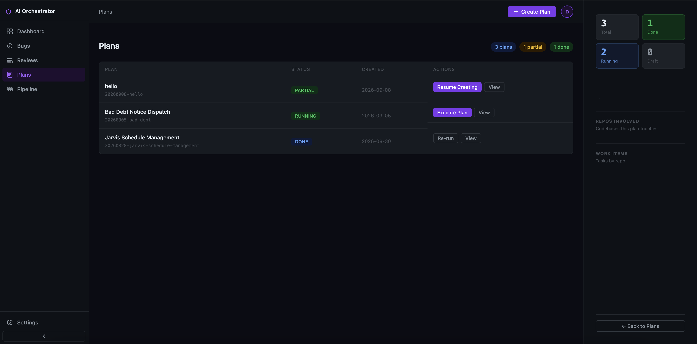

# AI Orchestrator

An AI-powered bug fix and feature planning orchestrator built on FastAPI + tmux + xterm.js. It drives Claude Code (or OpenCode) through the full bug-fix pipeline autonomously — from fetching bugs to opening PRs — using `SKILL.md` files as the workflow engine.



## Architecture

```
Browser (xterm.js)
      ↕ WebSocket (/ws/sessions/<id>)
FastAPI  ←── UI + session control only
      ↕ PTY / tmux attach-session
tmux  ←── persistent terminal layer
      ↕
Claude Code  ←── reads SKILL.md files, executes them
      ↕ reads/writes
Filesystem (bugs/, workspace/, repo-context/, plans/, reviews/)
```

## Prerequisites

- Python 3.10+
- tmux
- Claude Code CLI (`claude`) or OpenCode (`opencode`)
- Git + SSH access to your repos

---

## Setup

### 1. Clone this repo

```bash
git clone git@github.com:rohitit09/forgeflow-ai-orchestrator.git
cd forgeflow-ai-orchestrator
```

### 2. Run setup

Creates runtime directories, copies `env.example` → `.env`, scaffolds config files, and wires up symlinks:

```bash
./setup.sh
```

### 3. Fill in `.env`

```bash
# Server
HOST=0.0.0.0
PORT=8000

# Sentry
SENTRY_AUTH_TOKEN=sntryu_xxxxxxxxxxxxxxxxxxxx
SENTRY_ORG=your-org-slug
SENTRY_BASE_URL=https://sentry.your-org.com

# Jira
JIRA_BASE_URL=https://your-org.atlassian.net
JIRA_EMAIL=your.email@company.com
JIRA_USERNAME=your.email@company.com
JIRA_API_TOKEN=ATATTxxxxxxxxxxxxxxxxxxxxxx
JIRA_DEFAULT_PROJECT=YOUR_PROJECT

# GitHub
GITHUB_TOKEN=ghp_xxxxxxxxxxxxxxxx
```

### 4. Configure your repositories

Edit `config/repositories.json` — replace the example repos with your actual repos:

```json
{
  "id": "my_backend",
  "name": "My Backend",
  "type": "backend",
  "path": "workspace/my_backend",
  "git_url": "git@github.com:org/my_backend.git",
  "base_branch": "staging",
  "feature_merge_dest_branch": "dev",
  "bug_merge_dest_branch": "staging",
  "protected_branches": ["master", "staging"],
  "runtime": {
    "venv": "workspace/my_backend/env",
    "test_cmd": ". env/bin/activate && python manage.py test",
    "copy_files": [
      { "from": "workspace/my_backend/.env", "to": ".env" }
    ]
  }
}
```

Also edit `config/integrations.json` to add your Sentry and Jira project mappings.

### 5. Clone your repos into `workspace/`

```bash
git clone git@github.com:org/my_backend.git workspace/my_backend
git clone git@github.com:org/my_frontend.git workspace/my_frontend
```

### 6. Build repo context

Run once per repo so the agent has pre-built knowledge before fixing bugs:

```bash
# All repos
/repo-context

# Single repo
/repo-context my_backend
```

---

## Running

```bash
./run.sh
```

Then open [http://localhost:8000](http://localhost:8000) in your browser.

For hot-reload during development:

```bash
source .venv/bin/activate
uvicorn app.main:app --host 0.0.0.0 --port 8000 --reload
```

---

## Slash Commands

| Command | What it does |
|---------|-------------|
| `/list-bugs source=sentry project=X` | Fetch bugs from Sentry or Jira → `bugs/<id>/` |
| `/fix-bug <bug-id>` | Full 13-step pipeline: diagnose → plan → implement → PR |
| `/repo-context [repo-id]` | Build repo knowledge under `repo-context/<id>/` |
| `/create-plan <requirement>` | Interactive planner → `plans/<slug>/plan.json` |
| `/execute-plan <plan-id>` | Run an approved plan through the DAG loop |
| `/resume-plan <plan-id>` | Resume a crashed or interrupted plan |
| `/code-review <pr-url>` | Review a GitHub PR, write output to `reviews/` |

---

## Tests

```bash
source .venv/bin/activate
pytest tests/ -v
```

---

## Project Structure

```
ai-orch/
├── app/           ← FastAPI (UI + API only)
├── skills/        ← All workflow logic (SKILL.md files)
├── commands/      ← Slash command wrappers (source of truth)
├── agents/        ← Custom agent definitions
├── config/        ← repositories.json, integrations.json, agents.json
├── workspace/     ← Cloned repos (git clone here)
├── bugs/          ← One directory per bug (written by skills)
├── plans/         ← One directory per plan
├── repo-context/  ← Pre-built repo knowledge
├── reviews/       ← Code review output
├── .env           ← Your credentials (never commit)
├── setup.sh       ← First-time setup
└── run.sh         ← Start the app
```
